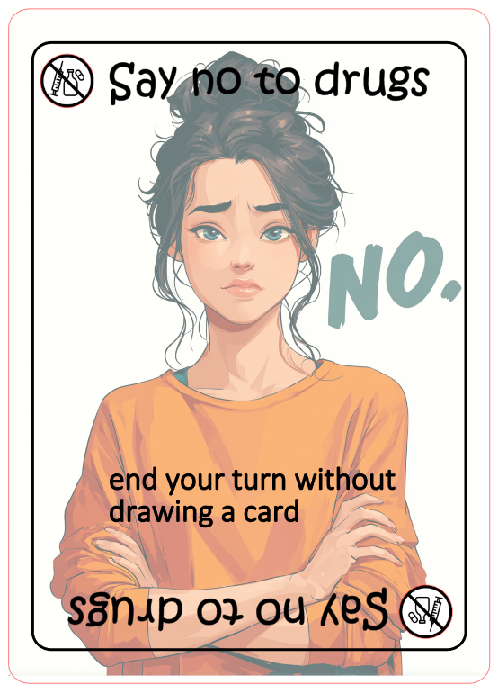
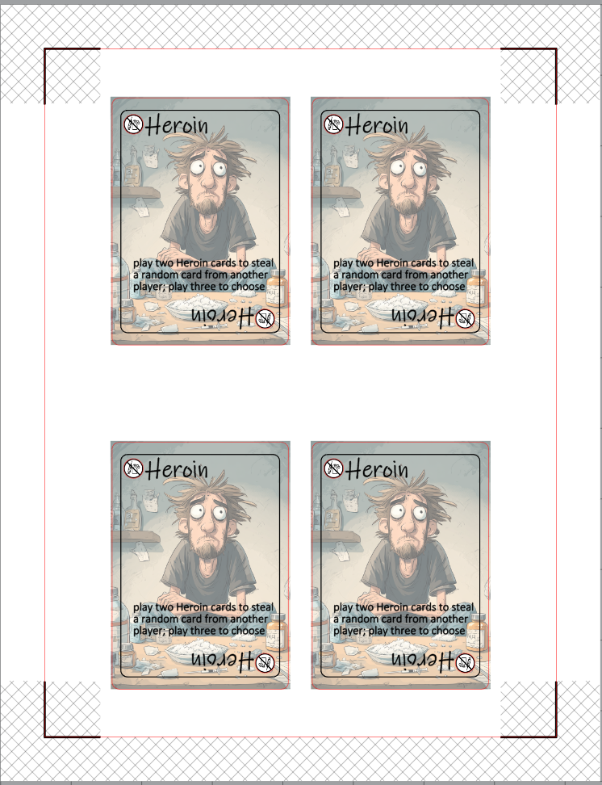
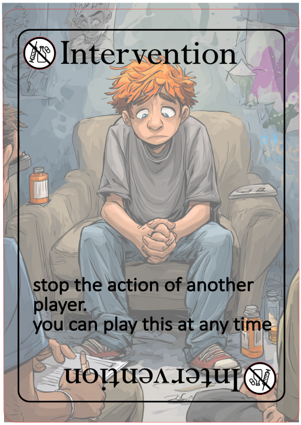
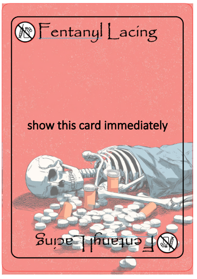

# Drug card game inspired by Exploding Kittens

## Overview
For a 10th grade Health final at Cohasset High School, students were asked to create a board game or card game with the information they learned about drugs and drug abuse during the semester.

Me and my 16yo took inspiration from the game Exploding Kittens and replaced all of the cards to be related to drugs.

## Supplies
- This was printed on 110lb (300g /m^2) cardstock paper. (Recollections brand, purchased from Michaels craft store) using an inkjet printer
- The templates are for the Silhouette Cameo 5alpha paper cutter, assembled with Silhouette Studio
- The background images were created using Midjourney

## Instructions

1. Print the pages on an inkjet printer
2. Align them on the cutting mat and load the cutting mat into the cameo
3. Settings were the defaults for "Cardstock, Heavy (105lb-122lbs)", with the AutoBlade set to a 7
4. Cut the cards and assemble the deck.

## Samples

